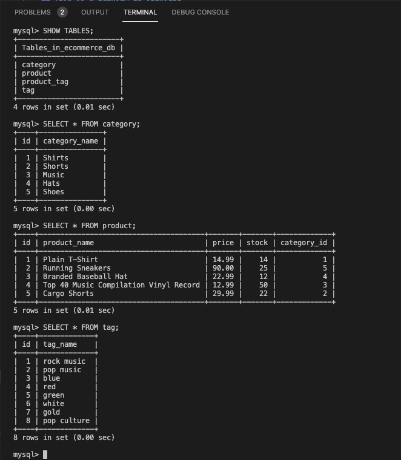
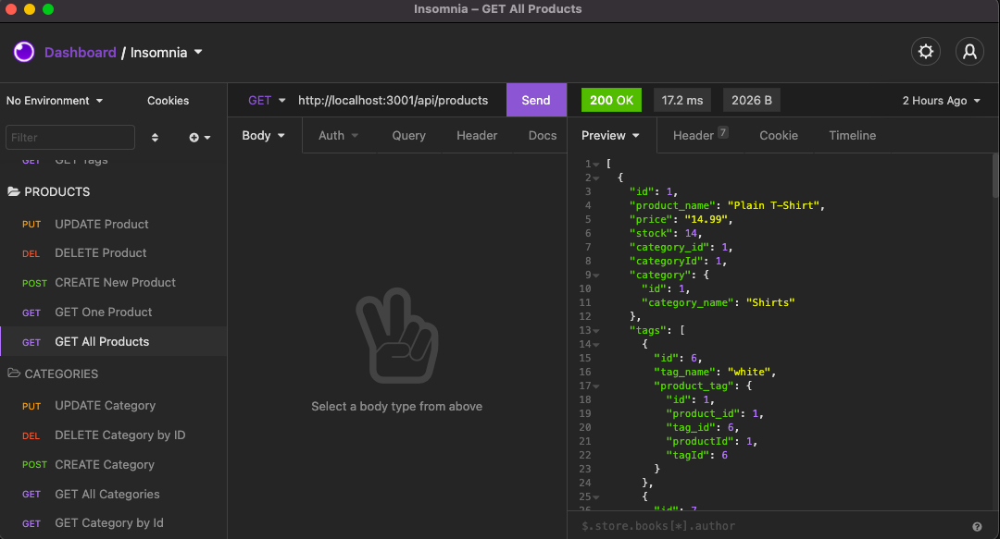

# E-Commerce

## Description

This is the back-end of an e-commerce for a business owner where you can add products, stock and tags. This will help you to have a better control of your inventory.

## This is a preview of the back-end

## This is the link of the app

[E Commerce Back End](https://github.com/salvadordiaz1222/E-Commerce-BE)
